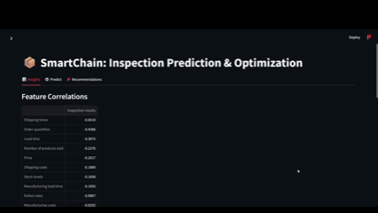

# SmartChain: Supply Chain Inspection Prediction & Optimization 🚚🔍


This project helps businesses predict product inspection outcomes and uncover hidden inefficiencies in their supply chain using real-world features such as cost, defect rate, lead time, and transportation.

## 🔧 Features
- Predict inspection pass/fail using a trained ML model
- Simulated data ingestion pipeline using SQLite
- Business recommendation engine
- Streamlit dashboard with 3-tab UX

## 🛠 Tech Stack
- Python (Pandas, Scikit-learn, Streamlit)
- SQLite for simulating ingestion pipeline
- Jupyter Notebook for EDA

## 🚀 Run Locally

```bash
pip install -r requirements.txt
streamlit run app/app.py
``` 
